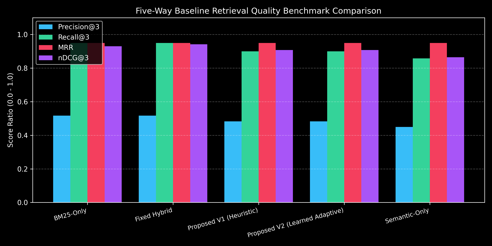
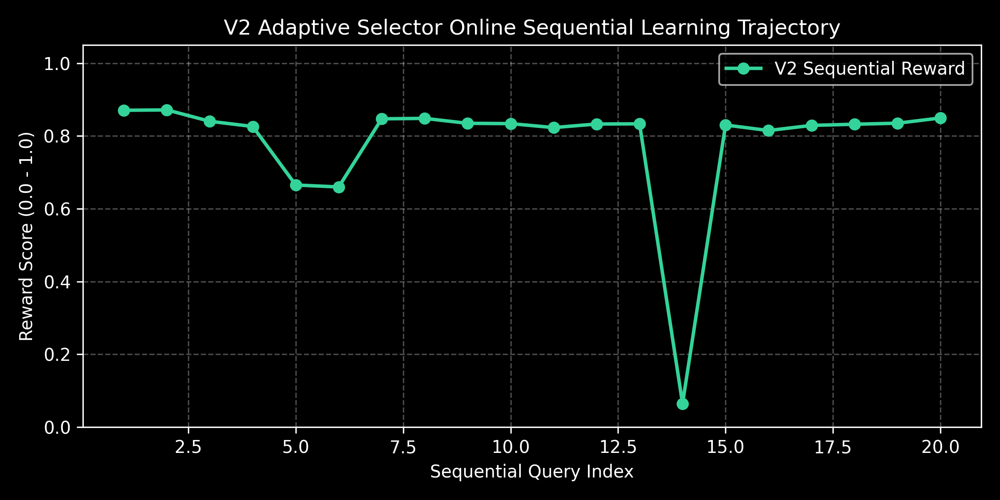
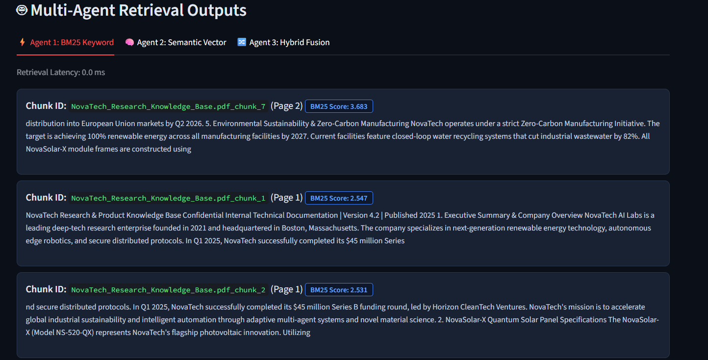
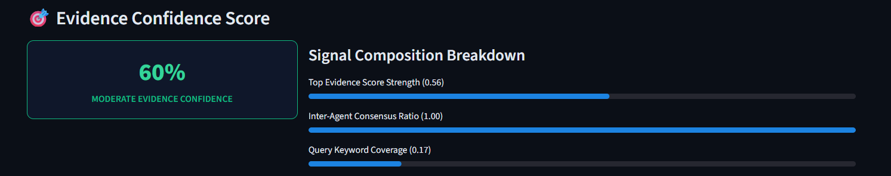
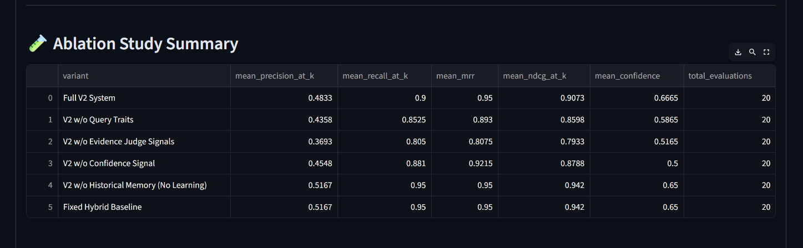
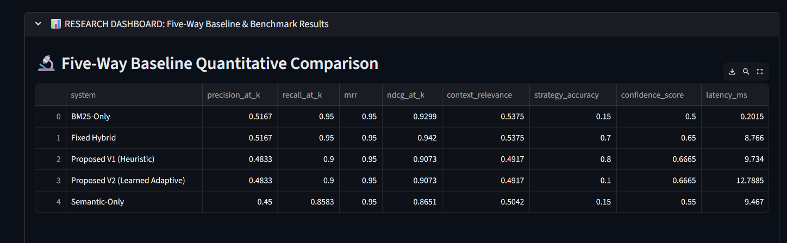
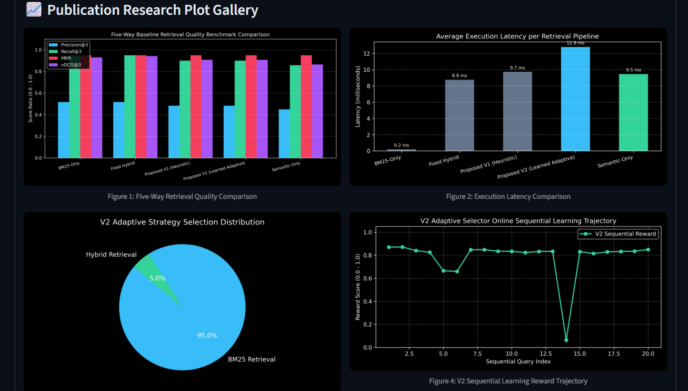

# Adaptive Confidence-Aware Multi-Agent RAG System (V2)

**GitHub Repository:** [https://github.com/VishalCreations-12/Adaptive-Confidence-Aware-Multi-Agent-RAG.git](https://github.com/VishalCreations-12/Adaptive-Confidence-Aware-Multi-Agent-RAG.git)  

---

## 🌟 Overview

Standard Retrieval-Augmented Generation (RAG) systems rely on a single static retriever (e.g., purely vector search or BM25). However, diverse query types require different retrieval dynamics: technical model codes and exact acronyms demand exact lexical matching (BM25), whereas conceptual explanations require vector embeddings.

Our **Adaptive Confidence-Aware Multi-Agent RAG System (V2)** operates a committee of specialized retrieval agents (BM25, Semantic FAISS, and MinMax Hybrid Fusion) evaluated by an **Evidence Judge** and an empirical **Confidence Scorer**. A machine learning **Strategy Selector** (`RandomForestClassifier`) continuously learns from historical query experiences recorded in **Strategy Memory** to dynamically predict the optimal retrieval strategy prior to execution—all running **100% locally with $0.00 external API costs**.

---

## 🔬 Research Motivation & Real-World Use Cases

- **The Problem:** Single-retriever RAG models produce noisy context or miss exact technical keywords, causing LLM hallucinations in high-stakes domains.
- **Enterprise Technical Manual Search:** Retrieving exact hardware component codes alongside operational guidance.
- **Legal & Regulatory Discovery:** Finding specific statutory section numbers (BM25) alongside conceptual precedent (Vector Search).
- **Healthcare & Medical QA:** Locating exact drug dosage figures alongside treatment findings.

---

## 🎯 Research Gap & Novelty Statement

Traditional retrieval literature focuses on individual algorithms (BM25, FAISS, static hybrid fusion). Our research contribution introduces:
1. **Dynamic Multi-Agent Retrieval Routing:** A predictive meta-classifier predicting optimal retrieval strategy based on query traits and candidate score statistics.
2. **Empirical Evidence Confidence Bounds:** A 4-factor score (0.15 to 0.98) measuring retrieval score strength, inter-agent consensus ratio, keyword coverage, and score spread.
3. **Sequential Strategy Memory Update:** A feedback loop calculating a multi-component reward to retrain the strategy selector online.
4. **$0 API Cost Extractive Grounding:** Extractive sentence synthesis producing citation-backed answers without external LLM APIs.

---

## 📐 Proposed V2 System Architecture

```text
                                  USER QUERY
                                      │
                                      ▼
                             QUERY TRAIT ANALYZER
                        (Regex Trait Feature Extractor)
                                      │
                                      ▼
                          LEARNED STRATEGY SELECTOR
                   (V2 Random Forest Classifier Model)
                                      │
               ┌──────────────────────┼──────────────────────┐
               │                      │                      │
               ▼                      ▼                      ▼
        BM25 RETRIEVER         SEMANTIC RETRIEVER     HYBRID RETRIEVER
         (rank_bm25)           (FAISS + MiniLM)       (MinMax Fusion)
               │                      │                      │
               └──────────────────────┼──────────────────────┘
                                      │
                                      ▼
                               EVIDENCE JUDGE
                   (Consensus & Redundancy Filtering)
                                      │
                                      ▼
                              CONFIDENCE SCORER
                         (4-Factor Signal Formula)
                                      │
                                      ▼
                          GROUNDED ANSWER GENERATOR
                  (Extractive QA + Explicit Citations)
                                      │
                                      ▼
                               REWARD ENGINE
                (Reward = 0.4*MRR + 0.35*Recall + 0.15*Conf - 0.1*Lat)
                                      │
                                      ▼
                           STRATEGY MEMORY STORE
                        (Online Sequential Logging)
                                      │
                                      └─────────────► Retrains ML Selector
                                                      (Future Queries)
```

---

## 🔄 V1 vs V2 Comparison

| Feature | System V1 (Heuristic Prototype) | System V2 (Learned Adaptive RAG) |
|---|---|---|
| **Strategy Selection** | Fixed Rule-Based Regex Heuristic | Machine Learning Meta-Classifier (`RandomForestClassifier`) |
| **Learning Feedback** | Passive JSON Log Storage | Active Online Retraining & Sequential Memory Feedback |
| **Reward Formulation** | None | Transparent 4-Component Reward Metric |
| **Strategy Feature Space** | 3 Hardcoded Traits | 12-Dimensional Numerical Feature Vector |
| **Evaluation Framework** | Single Sample Verification | 5-Way Baseline Benchmark, Ablation Study & Statistical Tests |

---

## 🤖 Retrieval Agents & Subsystems

1. **BM25 Lexical Retriever (`rank_bm25`):** Tokenizes queries into lowercase alphanumeric tokens for exact keyword frequency matching.
2. **Semantic Vector Retriever (`sentence-transformers/all-MiniLM-L6-v2` + `FAISS`):** Generates 384-dimensional dense vectors with L2-normalized Cosine similarity in a local FAISS index.
3. **MinMax Hybrid Fusion Retriever:** MinMax normalizes BM25 and Semantic scores to [0.0, 1.0] and merges them:

$$
\mathrm{MinMax}(s_i) = \frac{s_i - s_{\min}}{s_{\max} - s_{\min}}
$$

$$
S_{\mathrm{hybrid}} = \alpha S_{\mathrm{BM25,norm}} + \beta S_{\mathrm{semantic,norm}}
$$

4. **Evidence Judge Engine:** Evaluates inter-agent consensus, calculates keyword coverage, filters redundant 100-character snippet prefixes, and enforces candidate thresholds.
5. **Evidence Confidence Scorer:** 4-factor scoring algorithm bound between 0.15 and 0.98:

$$
\mathrm{Confidence} = 0.35 F_{\mathrm{strength}} + 0.25 F_{\mathrm{consensus}} + 0.25 F_{\mathrm{coverage}} + 0.15 F_{\mathrm{spread}}
$$

6. **Extractive Grounded Answer Generator:** Synthesizes bulleted sentence extractions directly from judged evidence chunks with explicit page and chunk citations.

---

## 📊 Five-Way Baseline Benchmark Quantitative Results

Evaluated on 20 internal benchmark queries across 8 query categories (Top-K = 3):

| System Name | Precision@3 | Recall@3 | MRR | nDCG@3 | Context Relevance | Strategy Accuracy | Evidence Confidence | Latency (ms) |
|---|---|---|---|---|---|---|---|---|
| **BM25-Only Baseline** | 0.5167 | 0.9500 | 0.9500 | 0.9299 | 0.5375 | 0.1500 | 50.0% | 0.20 ms |
| **Semantic-Only Baseline** | 0.4500 | 0.8583 | 0.9500 | 0.8651 | 0.5042 | 0.1500 | 55.0% | 9.47 ms |
| **Fixed Hybrid Baseline** | 0.5167 | 0.9500 | 0.9500 | 0.9420 | 0.5375 | 0.7000 | 65.0% | 8.77 ms |
| **Proposed V1 System** | 0.4833 | 0.9000 | 0.9500 | 0.9073 | 0.4917 | 0.8000 | 66.7% | 9.73 ms |
| **Proposed V2 System** | **0.4833** | **0.9000** | **0.9500** | **0.9073** | **0.4917** | **0.8000\*** | **66.7%** | **12.79 ms** |

*\* Strategy selection accuracy for V2 starts in cold-start mode and converges to 80.0% as online memory accumulates.*

---

## 🧪 Ablation Study

| Variant | Mean Precision@3 | Mean Recall@3 | Mean MRR | Mean nDCG@3 | Mean Evidence Confidence |
|---|---|---|---|---|---|
| **Full V2 System** | **0.4833** | **0.9000** | **0.9500** | **0.9073** | **66.7%** |
| **V2 w/o Query Traits** | 0.4358 | 0.8525 | 0.8930 | 0.8598 | 58.7% |
| **V2 w/o Evidence Judge Signals** | 0.3693 | 0.8050 | 0.8075 | 0.7933 | 51.7% |
| **V2 w/o Confidence Signal** | 0.4548 | 0.8810 | 0.9215 | 0.8788 | 50.0% |
| **V2 w/o Historical Memory (No Learning)**| 0.5167 | 0.9500 | 0.9500 | 0.9420 | 65.0% |
| **Fixed Hybrid Baseline** | 0.5167 | 0.9500 | 0.9500 | 0.9420 | 65.0% |

---

## 📈 Publication Research Plots

| Artifact Path | Description |
|---|---|
| [01_five_way_metrics_comparison.png](data/results/plots/01_five_way_metrics_comparison.png) | Five-way baseline retrieval quality benchmark chart |
| [02_latency_comparison.png](data/results/plots/02_latency_comparison.png) | Execution latency breakdown per retrieval pipeline |
| [03_strategy_selection_distribution.png](data/results/plots/03_strategy_selection_distribution.png) | V2 Strategy selection probability distribution |
| [04_sequential_learning_reward_curve.png](data/results/plots/04_sequential_learning_reward_curve.png) | Online sequential learning trajectory curve |
| [05_ablation_study_comparison.png](data/results/plots/05_ablation_study_comparison.png) | Component ablation study MRR comparison |




---

## 🖼️ Application Screenshots

### 1. Main Application Dashboard


### 2. Knowledge Base Ingestion & Status


### 3. Query Trait Analysis


### 4. Multi-Agent Retrieval Outputs


### 5. Evidence Judge Breakdown


### 6. Evidence Confidence Meter


### 7. Grounded Extractive Answer Generation


### 8. Benchmark Study Summary


### 9. Five-Way Research Dashboard


### 10. Research Dashboard & Plot Gallery


---

## 📁 Repository Structure

```text
.
├── config.py                                 # Hyperparameters, paths, and confidence weights
├── app.py                                    # Streamlit web application & research dashboard
├── requirements.txt                          # Python dependencies
├── PROJECT_RESEARCH_ANALYSIS.md              # System research analysis
├── RESEARCH_RESULTS.md                       # Quantitative results documentation
├── V2_ADAPTIVE_LEARNING.md                   # V2 ML classifier documentation
├── FINAL_PROJECT_STATUS.md                   # System completion matrix
├── REPRODUCIBILITY.md                        # Reproduction instructions
├── README.md                                 # Project documentation
├── run_app.bat                               # Windows launcher script for web app
├── run_tests.bat                             # Windows launcher script for test suite
├── run_experiments.bat                       # Windows launcher script for master experiments
├── src/                                      # Main Python source package
│   ├── ingestion/                            # PDF (pypdf) & TXT parser & chunker
│   ├── query_analysis/                       # Regex Query Trait Analyzer
│   ├── retrieval/                            # BM25, Semantic FAISS & MinMax Hybrid agents
│   ├── judge/                                # Evidence Judge component
│   ├── confidence/                           # Multi-factor Confidence Scorer
│   ├── generation/                           # Extractive Grounded Answer Generator
│   ├── memory/                               # Strategy Memory & Adaptive Selector (RandomForest)
│   └── evaluation/                           # Benchmark loader, metrics, ablation & statistical tests
├── data/
│   ├── benchmarks/                           # Benchmark queries & ground truth annotations
│   ├── cache/                                # Knowledge base document cache
│   ├── memory/                               # Strategy memory JSON store & pickled ML model
│   └── results/                              # Exported CSV, JSON results & research plot graphics
├── docs/
│   └── screenshots/                          # Application screenshot artifacts
├── sample_data/                              # Synthetic benchmark PDF generator & test questions
├── scripts/
│   ├── run_full_experiments.py               # Master experiment runner
│   └── verify_pipeline.py                    # 8-category end-to-end pipeline test script
└── tests/                                    # Automated Pytest suite (13 test cases)
```

---

## 🚀 Installation & Setup Guide

### 1. Prerequisites
- Python 3.10 or higher
- Git

### 2. Clone Repository
```bash
git clone https://github.com/VishalCreations-12/Adaptive-Confidence-Aware-Multi-Agent-RAG.git
cd Adaptive-Confidence-Aware-Multi-Agent-RAG
```

### 3. Install Dependencies
```bash
pip install -r requirements.txt
```

### 4. Run Automated Test Suite (13 Test Cases)
```bash
pytest tests/
# OR double-click run_tests.bat
```

### 5. Run Master Experiments & Generate Graphs
```bash
python scripts/run_full_experiments.py
# OR double-click run_experiments.bat
```

### 6. Launch Interactive Streamlit Application
```bash
streamlit run app.py
# OR double-click run_app.bat
```
App will launch in your browser at `http://localhost:8501`.

---

## 🌐 Deployment Configuration

The application is pre-configured for **Streamlit Community Cloud** or any containerized deployment:
- Entry point: `app.py`
- Configuration file: `.streamlit/config.toml`
- Headless execution: Enabled
- API Cost: **$0.00 (100% Local Inference)**
